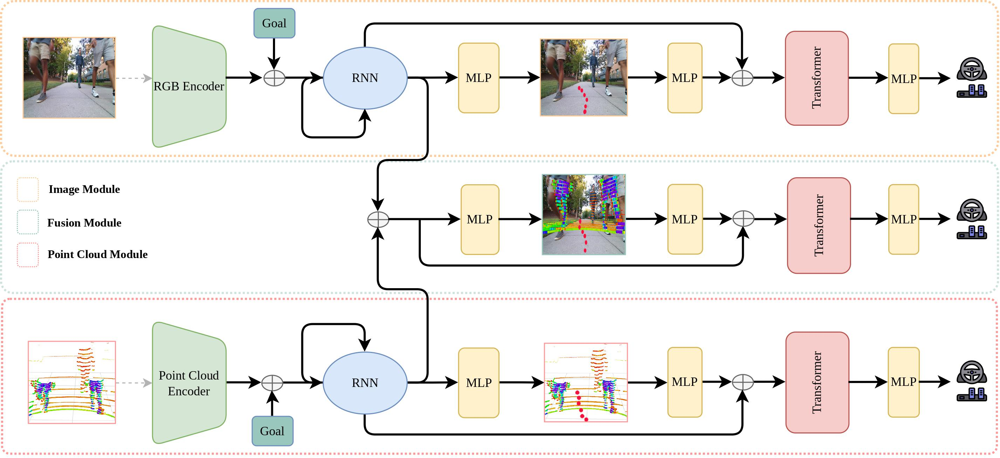

# Multimodal-Fusion-Network

## Network Architecture

You can find our paper on: I will put the arXiv link here.

For a visual overview of our paper please, visit: https://www.youtube.com/watch?v=5j8mAK9ecjs

       

## Parsing Data from SCAND ROSBAGS

You can download `SCAND ROSBAGS` from `https://dataverse.tdl.org/dataset.xhtml?persistentId=doi:10.18738/T8/0PRYRH`. 

All this files will be used to extract necessary sensor data for training the model.

You can use `wget` to download files with their corresponding URL.

1. For parsing data, create a folder `recorded-data` and `bagfiles` folder in the root.
2. Place all the rosbag files in `bagfiles` directory.
3. Run `/scripts/parser/parse_runner.py`
4. All recorded file will be parsed inside `recorded-data` folder.

This step will parse all the necessary information from rosbag files for training.

In the `recorded-data` folder you will be able to see all `RGB Images` and a `snapshot.pickle` file which contains `LiDAR` and other necessary information.

Corresponding to each rosbag file, there should be folder in `recorded-data`. 

### Splitting into Training and Test set

Once all the training data are parsed create two folders inside `recorded-data` that are `train` and `val`.

You can split the parsed folder in `recorded-data` between these two directory to create appropriate split.

Refer to the labels from `SCAND ROSBAGS` to identify different social scenarios to split the data appropriately.

## Training Model

- Once you have created the split you are ready to train the model.

- Run `/scripts/multimodal.py` to start the training process.

- The code uses `comet.ml` to track all the training metrics.

- You can turn off all the experiment logs, if prefer to do the training without any monitoring.

- If you wish to use `comet.ml` replace the `API_KEY` with your `API_KEY` key.

- Visit `https://www.comet.com/docs/v2/api-and-sdk/rest-api/overview/#obtaining-your-api-key` to get your `API_KEY`.

### Training Details
- The model will be saved after an interval of 10 epochs. You can modify `multimodal.py` to store the model at appropriate checkpoint.
- The testing inference will run at an interval of 2 epochs.